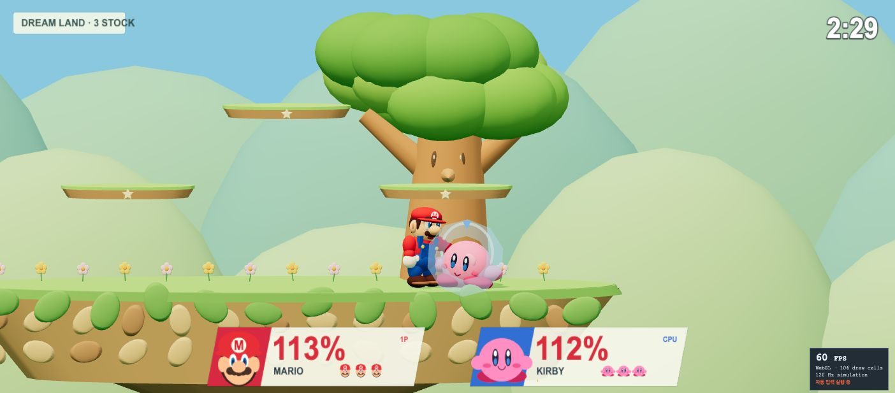
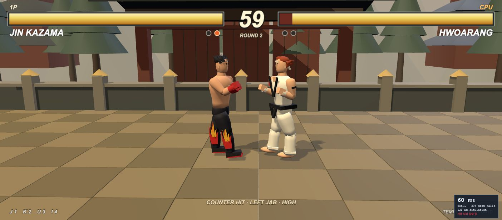
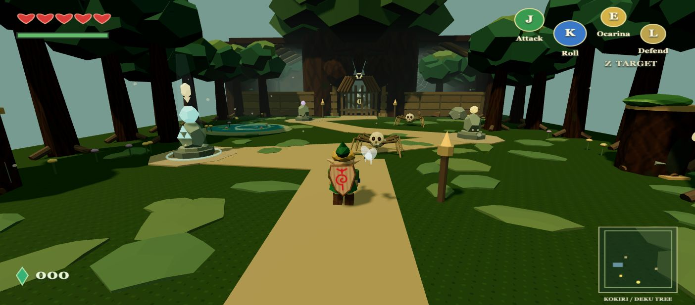
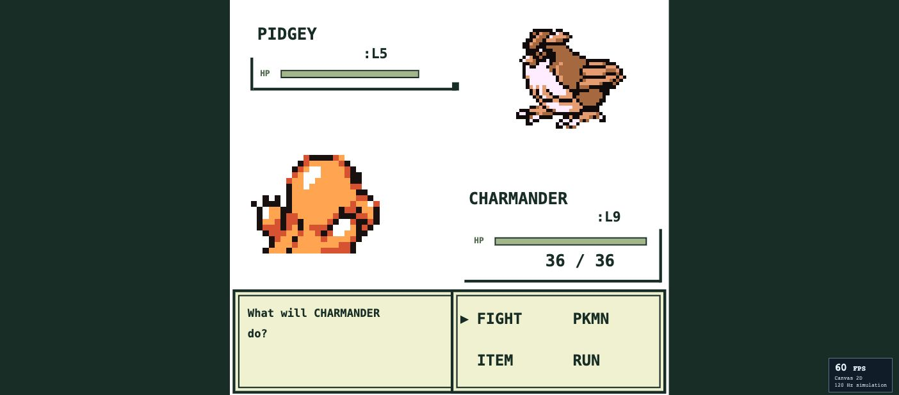

# Benchmark Games — 방과후 오락실

[직접 플레이](https://minwoo19930301.github.io/benchmark-games/#arcade) · [구현·검증 범위](docs/rebuild-verification.md) · [에셋 출처](docs/ASSET-CREDITS.md)

브라우저에서 플레이하고 성능을 측정하는 **13개 게임 모음**입니다. 11종을 원작의 캐릭터, 화면 구성, 조작 방식에 맞춰 다시 구현했습니다. 이전의 택배·야근·가상 캐릭터 테마를 제거했습니다. Mario와 Sonic은 기존 버전입니다.

## 다시 만든 11종

| 게임 | 구현한 플레이 | 현재 범위 |
| --- | --- | --- |
| [슈퍼스매시브라더스](https://minwoo19930301.github.io/benchmark-games/#smash) | 마리오 대 커비, 드림랜드 3단 발판, 퍼센트·스톡, 방향 공격·공중기·차지 스매시·실드·구르기·잡기·던지기·복귀 | 두 캐릭터의 3스톡 CPU 대전 한 판 |
| [철권 3](https://minwoo19930301.github.io/benchmark-games/#iron) | 진 대 화랑, 네 팔다리 공격, 상·중·하단, 뒤로 가드, 횡이동, 대시, 띄우기·공중 타격·다운 | 두 캐릭터의 일부 기술과 2선승 대전 |
| [시간의 오카리나](https://minwoo19930301.github.io/benchmark-games/#ocarina) | 링크·나비, 코키리 숲과 데크나무 내부, Z 주목, 검 연계·회전베기·방향 방패·구르기·6음 오카리나 | 숲과 던전 방 하나로 압축한 퀘스트 |
| [메탈슬러그](https://minwoo19930301.github.io/benchmark-games/#commando) | 마르코·모덴군, 한 번의 피격으로 목숨 소모, 근접 칼, 헤비 머신건 탄약, 수류탄, 포로, SV-001 장갑·파괴 시 탈출 | 정글·폐허와 테츠유키 전투를 포함한 짧은 미션 |
| [포켓몬스터 1세대](https://minwoo19930301.github.io/benchmark-games/#pocket) | 레드·파이리, 1세대 앞/뒤 스프라이트, FIGHT/PKMN/ITEM/RUN 메뉴, 타입 상성·교체·포획·라이벌 | 5종의 포켓몬과 두 종류 포획 퀘스트 |
| [록맨 X4](https://minwoo19930301.github.io/benchmark-games/#x4) | X·제로, 스카이 라군, 대시 점프·벽차기·차지 버스터·세이버, 에레기온 | 짧은 재구성 스테이지 |
| [록맨 X5](https://minwoo19930301.github.io/benchmark-games/#x5) | 저중력 천문대, 공중 대시·이동 발판, 다크 네크로뱃 | 짧은 재구성 스테이지 |
| [록맨 X6](https://minwoo19930301.github.io/benchmark-games/#x6) | 마그마 에어리어, 위험 구간, 블레이즈 히트닉스 | 짧은 재구성 스테이지 |
| [스타크래프트](https://minwoo19930301.github.io/benchmark-games/#colony) | 테란 SCV·마린·커맨드센터·배럭·보급고·벙커, 광물 운반, 보급 제한, 선행 건물, 주둔·하차·선택·명령·전장의 안개 | 테란 대 테란의 지상전 한 임무 |
| [오버워치](https://minwoo19930301.github.io/benchmark-games/#watchpoint) | 솔저: 76, 25발 펄스 소총, 나선 로켓, 질주, 생체장, 시야·엄폐를 따르는 6초 전술 조준경 | 9개 봇과 아군 2명이 있는 항만 훈련 전장 |
| [불소년과 물소녀](https://minwoo19930301.github.io/benchmark-games/#temple) | 불·물 캐릭터, 숲의 사원, 원소 함정·색상 다이아몬드·압력 발판·레버·출구 | 한 키보드 협동 또는 교대 조작, 방 3개 |

<p>
<a href="https://minwoo19930301.github.io/benchmark-games/#smash"></a>
<a href="https://minwoo19930301.github.io/benchmark-games/#iron"></a>
<a href="https://minwoo19930301.github.io/benchmark-games/#ocarina"></a>
<a href="https://minwoo19930301.github.io/benchmark-games/#pocket"></a>
</p>

원작 전체를 실행하는 에뮬레이터가 아닙니다. 스테이지 배치, 모델, 기술 수와 프레임 수치가 원작과 다르며, 전체 캠페인·전체 로스터·온라인 대전은 구현하지 않았습니다. 포켓몬 스프라이트는 공개된 PokéAPI 저장소에서 가져와 프로젝트에 포함했고, 메탈슬러그 캐릭터·배경, 록맨 X·제로에도 출처를 기록한 스프라이트를 포함했습니다. 3D 모델과 나머지 배경은 코드로 제작했습니다. 권리·출처 구분은 [에셋 기록](docs/ASSET-CREDITS.md)에 있습니다.

## 조작

각 게임 하단에 현재 조작이 표시됩니다. **Esc**는 일시정지, 상단 **소리** 버튼은 합성 효과음, **⛶**는 전체 화면입니다.

| 게임 | 주요 키 |
| --- | --- |
| 스매시 | 방향키 이동·방향 공격 · Space 점프 · J 공격 · Q 차지 스매시 · K 특수기 · L 실드/구르기 · E 잡기/던지기 |
| 철권 | J 왼손 · K 오른손 · U 왼발 · I 오른발 · 뒤로 가드 · 아래로 웅크리기 · 위/Space 횡이동 · 방향키 두 번 대시 |
| 젤다 | WASD/방향키 이동 · Z 주목 · J 검/길게 눌렀다 떼면 회전베기 · K 구르기 · L 방패 · E 오카리나 · Space 점프 · 오른쪽 마우스 드래그 시점 |
| 메탈슬러그 | 방향키 이동/위 조준 · J 사격/근접 칼 · K 수류탄 · Space 점프 · L/아래 앉기 · E 슬러그 탑승 |
| 포켓몬 | 방향키 이동/메뉴 선택 · Space 확인 · F 뒤로 · J 기본기 · K 속성기 · L 몬스터볼 · E 대화/회복 |
| 록맨 X4·5·6 | 좌우 이동 · Space 점프/벽차기 · J 엑스 차지 버스터/제로 세이버 · K 제로 세이버(X6는 엑스도 사용) · L 대시 · F X/제로 선택 · E 구조 |
| 스타크래프트 | 클릭/드래그 선택 · 우클릭 이동/공격/채집/벙커 진입 · 하단 건설·생산·명령 버튼 · 미니맵 시점 이동 |
| 오버워치 | WASD 이동 · 클릭/J 사격 · 우클릭/L 나선 로켓 · Shift/K 누르는 동안 질주 · E 생체장 · R 재장전 · Q 전술 조준경 |
| 불소년·물소녀 | 방향키/Space 선택 캐릭터 · WAD 다른 캐릭터 · F 전환 · E 레버 · R 현재 방 재시작 |

## 벤치마크

게임 목록의 **스매시·철권 벤치마크** 또는 **전체 11종 벤치마크**를 실행합니다. 각 게임에서도 개별 실행할 수 있습니다. 자동 플레이는 실제 이동·공격·명령 입력을 사용하며, 위치·체력·승리 상태를 바꾸지 않습니다. 창을 숨기거나 포커스를 잃으면 일시정지합니다.

평균 FPS, 프레임 간격 p95, 프레임당 CPU 작업 시간, 결과, 시뮬레이션 시간과 화면 크기를 기록합니다. 기록에 구현 버전을 포함합니다. 이전 패러디 버전의 기록과는 별도 저장합니다. 최근 30개 결과는 현재 브라우저에 저장되며 JSON으로 내려받을 수 있습니다. 서버로 전송하지 않습니다. CPU 작업 시간은 GPU 비용이 아니며, 같은 기기·브라우저·화면에서 비교해야 합니다.

## Sonic — Seaside Sprint

푸른 해안을 달리며 링을 모으고 결승선까지 도달하는 2.5D 코스입니다. 120Hz 고정 물리로 가속·제동·경사면 관성을 계산합니다. 부스트로 속도를 얻으면 원형 트랙의 바닥, 양옆, 정상을 연속해서 지나 **360도 루프**를 완주합니다. 속도가 부족하면 아래쪽 지상 경로로 통과할 수 있습니다.

스프링, 부스트 패드, 적, 가시, 체크포인트가 배치되어 있습니다. 링이 있으면 피격 시 링을 잃고 잠시 보호받으며, 링 없이 맞으면 목숨을 잃습니다. 목숨은 3개이고, 남은 목숨이 있으면 마지막 체크포인트에서 이어갑니다. 소리는 사용자가 켰을 때만 재생되는 합성 효과음입니다. 직접 플레이한 최고 완주 시간은 해당 브라우저의 `localStorage`에 저장됩니다.

| 동작      | 키보드                      |
| --------- | --------------------------- |
| 이동      | ← / → 또는 A / D            |
| 점프      | Space / W / ↑               |
| 구르기    | ↓ / S                       |
| 스핀 대시 | Shift를 눌러 충전한 뒤 떼기 |
| 일시 정지 | Esc                         |

화면의 터치 버튼으로도 이동·점프·구르기·스핀 대시를 조작할 수 있습니다. 창 포커스를 잃거나 탭을 숨기면 일시 정지하고 눌린 입력을 해제합니다.

FPS 패널의 **자동 벤치마크**는 같은 게임 시뮬레이션에 일반 이동·점프·충전 입력을 보내 코스를 진행합니다. 플레이어를 순간 이동시키거나 무적 상태로 만들지 않습니다. 자동 완주는 개인 최고 기록에 포함되지 않으며, FPS 수치는 현재 브라우저와 기기의 실행 결과입니다.

[소닉 검증 범위와 실행 근거](docs/sonic-verification.md)

## Mario 2.5D — Green Hills

[](https://minwoo19930301.github.io/benchmark-games/#mario)

Arrow keys / A,D move; Space / W / Up jump; hold Shift to run; Escape pauses. Touch controls support movement and jumping. Release jump for a short hop. Jump on enemies, collect coins and reach the flag; three lives and a 180-second timer. Blur or a hidden tab pauses and clears held controls.

## Run

Node 22.13+와 npm이 필요합니다.

```sh
npm ci
npm run dev
```

`http://127.0.0.1:4180/`에서 목록을 엽니다. `npm run build`는 정적 `dist/`를 만들며, 선택한 게임만 지연 로드합니다. 게임 실행에 외부 에셋 서버나 API 키는 필요하지 않습니다.

## Verify

```sh
npm test
npm run typecheck
npm run lint
npm run build
npm audit
```

현재 재구현의 테스트 결과, 실제 화면과 범위는 [재구현 검증 기록](docs/rebuild-verification.md)을 확인하세요. 과거 배포 기록: [초기 5종](docs/retro-verification.md), [추가 6종](docs/expansion-verification.md), [Mario](docs/verification.md), [Sonic](docs/sonic-verification.md).

## Architecture

- `app/arcade.tsx`: 게임 목록, 경로, 자동 실행 큐와 결과 내보내기.
- `app/retro.tsx`: 시작·일시정지·도움말·터치 입력. 게임 내부 HUD가 화면 중심을 차지합니다.
- `lib/retro/runtime.ts`: 120Hz 고정 갱신, 입력 수명 관리와 프레임 계측.
- `lib/retro/{smash,iron,ocarina,commando,pocket,reploid,colony,watchpoint,temple}`: 순수 시뮬레이션, 실제 입력 벤치마크, 화면 렌더러.
- `public/previews`: 실제 브라우저 스크린샷. `public/assets/pokemon`: 로컬 1세대 스프라이트와 출처 기록.
- `lib/game`, `lib/sonic`: 기존 Mario와 Sonic. Mario의 선택적 `document.modelContext` 지원은 해당 API가 없으면 작동하지 않습니다.

<!-- PROJECT-LINKS:START -->

## 3D Playground

게임·공간·아바타를 한곳에서. 카드를 누르면 저장소로, 아래 버튼을 누르면 공개 데모 또는 실행 안내로 이동합니다.

<table>
<tr>
<td width="50%" valign="top">
<a href="https://github.com/minwoo19930301/seoul-flight-game"></a><br>
<a href="https://minwoo19930301.github.io/seoul-flight-game/"></a>
<a href="https://github.com/minwoo19930301/seoul-flight-game/pulls"></a><br>
<sub>서울 25구 확장은 main에 병합 · 공개 데모 반영은 별도 확인 필요</sub><br>
<sub><a href="https://github.com/minwoo19930301/seoul-flight-game">저장소</a> · <a href="https://github.com/minwoo19930301/seoul-flight-game/pull/1">병합된 개선 PR #1</a></sub>
</td>
<td width="50%" valign="top">
<a href="https://github.com/minwoo19930301/parking-master-webasm"></a><br>
<a href="https://parking-master-webasm.vercel.app/"></a>
<a href="https://github.com/minwoo19930301/parking-master-webasm/pulls"></a><br>
<sub>공개 데모는 이전 버전 · 최신 소스는 저장소</sub><br>
<sub><a href="https://github.com/minwoo19930301/parking-master-webasm">저장소</a> · <a href="https://github.com/minwoo19930301/parking-master-webasm/pull/2">병합된 개선 PR #2</a></sub>
</td>
</tr>
<tr>
<td width="50%" valign="top">
<a href="https://github.com/minwoo19930301/interior3d"></a><br>
<a href="https://minwoo19930301.github.io/interior3d/"></a>
<a href="https://github.com/minwoo19930301/interior3d/pulls"></a><br>
<sub>공개 데모는 이전 버전 · 19종 모델은 최신 소스</sub><br>
<sub><a href="https://github.com/minwoo19930301/interior3d">저장소</a> · <a href="https://github.com/minwoo19930301/interior3d/pull/1">병합된 개선 PR #1</a></sub>
</td>
<td width="50%" valign="top">
<a href="https://github.com/minwoo19930301/animal-metaverse"></a><br>
<a href="https://minwoo19930301.github.io/animal-metaverse/"></a>
<a href="https://github.com/minwoo19930301/animal-metaverse/pulls"></a><br>
<sub>3D 3종 + 2D 3종 · 아래에서 바로 선택</sub><br>
<sub><a href="https://github.com/minwoo19930301/animal-metaverse">저장소</a> · <a href="https://github.com/minwoo19930301/animal-metaverse/pull/1">병합된 개선 PR #1</a></sub>
</td>
</tr>
<tr>
<td width="50%" valign="top">
<a href="https://github.com/minwoo19930301/flamingo-chess"></a><br>
<a href="https://minwoo19930301.github.io/flamingo-chess/"></a>
<a href="https://github.com/minwoo19930301/flamingo-chess/pulls"></a><br>
<sub>플라밍고 vs 흑조 · AI 대국</sub><br>
<sub><a href="https://github.com/minwoo19930301/flamingo-chess">저장소</a> · <a href="https://github.com/minwoo19930301/flamingo-chess/pull/1">병합된 개선 PR #1</a></sub>
</td>
<td width="50%" valign="top">
<a href="https://github.com/minwoo19930301/animal-hood-girl-vtuber"></a><br>
<a href="https://github.com/minwoo19930301/animal-hood-girl-vtuber#실행"></a>
<a href="https://github.com/minwoo19930301/animal-hood-girl-vtuber/pulls"></a><br>
<sub>macOS 로컬 앱 · 웹 플레이 링크 없음</sub><br>
<sub><a href="https://github.com/minwoo19930301/animal-hood-girl-vtuber">저장소</a> · <a href="https://github.com/minwoo19930301/animal-hood-girl-vtuber/pull/1">병합된 개선 PR #1</a></sub>
</td>
</tr>
<tr>
<td width="50%" valign="top">
<a href="https://github.com/minwoo19930301/flamingo-arcade-2"></a><br>
<a href="https://github.com/minwoo19930301/flamingo-arcade-2#로컬에서-실행"></a>
<a href="https://github.com/minwoo19930301/flamingo-arcade-2"></a><br>
<sub>2D 패러디 8종 + 로우폴리 3D 대전 · 코드만 공개, 미배포</sub>
</td>
<td width="50%" valign="top">
<h3>두 번째 플라밍고 게임 서랍</h3>
<p>라면 · 부적 · 전대 · 철거 · 가상 바탕화면 · 폐차 · 흑백 격투 · 로켓슛 · 장외 대전</p>
<a href="https://github.com/minwoo19930301/flamingo-arcade-2#카트리지-서랍"></a>
<a href="https://github.com/minwoo19930301/flamingo-arcade-2/blob/main/docs/visual-references.md"></a>
</td>
</tr>
</table>

### ANIMALVERSE · 여섯 세계 바로가기

<p>
<a href="https://minwoo19930301.github.io/animal-metaverse/versions/3d/"></a>
<a href="https://minwoo19930301.github.io/animal-metaverse/versions/3d-r3f/"></a>
<a href="https://minwoo19930301.github.io/animal-metaverse/versions/3d-babylon/"></a>
<a href="https://minwoo19930301.github.io/animal-metaverse/versions/2d-pixel/"></a>
<a href="https://minwoo19930301.github.io/animal-metaverse/versions/2d-pastel/"></a>
<a href="https://minwoo19930301.github.io/animal-metaverse/versions/2d-iso/"></a>
</p>

<sub>2026-09-07 확인: 공개 데모 5곳과 ANIMALVERSE 세부 경로 6곳은 HTTP 응답 확인. 화면·조작 검증을 뜻하지 않습니다. 위 개선 PR 6개는 병합됐습니다. Interior3D 공개 데모는 이전 배포이며, Driving Practice 공개 데모의 최신 확장 반영도 확인되지 않았습니다. “최신 PR”에는 병합 전 변경이 포함될 수 있습니다.</sub>

<!-- PROJECT-LINKS:END -->
