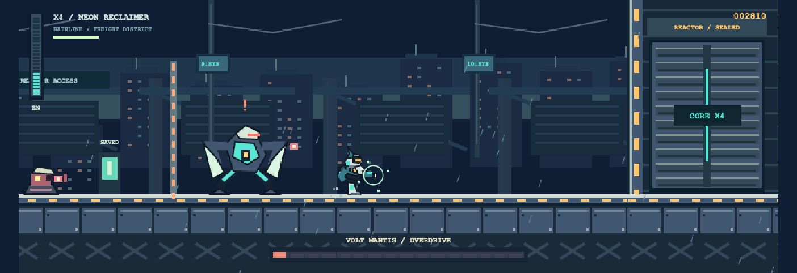
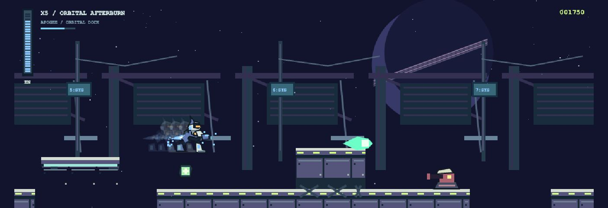
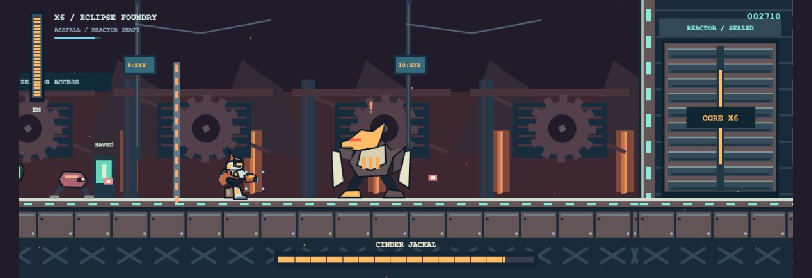
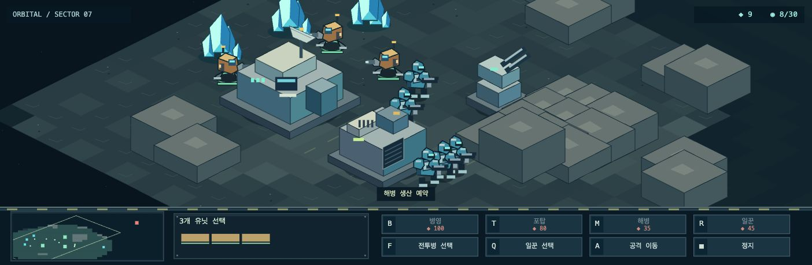
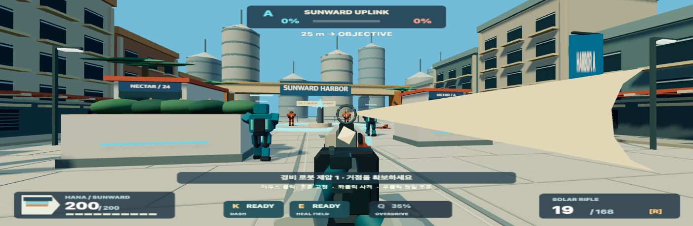
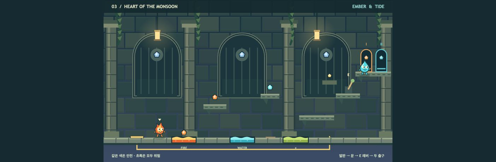
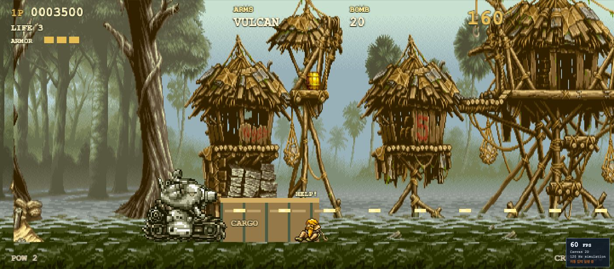

# Benchmark Games — 방과후 오락실

[](https://minwoo19930301.github.io/benchmark-games/)
[](https://github.com/minwoo19930301/benchmark-games)
[](#run)

브라우저에서 직접 플레이하고 성능도 기록하는 **13개 게임 모음**입니다. 기본 화면은 게임 목록인 **방과후 오락실(`#arcade`)**입니다. 오락실·PC방·플래시게임에서 착안한 독립 패러디 11종과 기존 Mario·Sonic을 선택할 수 있으며, 선택한 게임만 불러옵니다.

## 새로 추가된 6종

| 게임                                                                                                    | 참고 작품                     | 이번에 구현한 플레이                                                                                      |
| ------------------------------------------------------------------------------------------------------- | ----------------------------- | --------------------------------------------------------------------------------------------------------- |
| [네온 회수 작전](https://minwoo19930301.github.io/benchmark-games/#x4) · `#x4`                          | Mega Man X4                   | 대시 점프·벽차기·차지 버스터·세이버, 비 내리는 화물 도시와 볼트 맨티스 보스                               |
| [궤도 잔광](https://minwoo19930301.github.io/benchmark-games/#x5) · `#x5`                               | Mega Man X5                   | 저중력·공중 대시·움직이는 발판, 궤도 기지와 노틸러스 보스                                                 |
| [식의 용광로](https://minwoo19930301.github.io/benchmark-games/#x6) · `#x6`                             | Mega Man X6                   | 컨베이어·증기 분출·레이저 경고, 용광로와 신더 재칼 보스                                                   |
| [콜로니 커맨드](https://minwoo19930301.github.io/benchmark-games/#colony) · `#colony`                   | StarCraft                     | 일꾼 채집·광물 경제·병영/포탑 건설·생산 대기열·드래그 선택·우클릭 명령·전장의 안개·적 기지 공격           |
| [워치포인트: 항만 수호대](https://minwoo19930301.github.io/benchmark-games/#watchpoint) · `#watchpoint` | Overwatch                     | 마우스 시점 FPS·소총/정밀 조준·재장전·대시·회복 비콘·궁극기·아군/적 봇·거점 점령/경합                     |
| [불꽃과 물방울](https://minwoo19930301.github.io/benchmark-games/#temple) · `#temple`                   | Fireboy and Watergirl / Flash | 한 키보드 2인 협동, 캐릭터 전환으로 혼자 플레이, 원소 함정·수정·압력 발판·문 고정 레버·증기 분출과 3개 방 |

<p>
<a href="https://minwoo19930301.github.io/benchmark-games/#x4"></a>
<a href="https://minwoo19930301.github.io/benchmark-games/#x5"></a>
<a href="https://minwoo19930301.github.io/benchmark-games/#x6"></a>
<a href="https://minwoo19930301.github.io/benchmark-games/#colony"></a>
<a href="https://minwoo19930301.github.io/benchmark-games/#watchpoint"></a>
<a href="https://minwoo19930301.github.io/benchmark-games/#temple"></a>
</p>

각 작품의 핵심 조작을 독자적인 스테이지와 아트로 만든 짧은 플레이 구간입니다. 원작의 전체 캠페인·모든 유닛과 영웅·온라인 대전·애니메이션과 밸런스 전체를 재현한 제품은 아닙니다. X 계열은 각기 다른 세 스테이지이며, RTS와 FPS는 각각 한 임무/전장입니다. 실제 플레이 스크린샷과 검증 범위는 [추가 게임 검증 기록](docs/expansion-verification.md)에 남깁니다.

| 새 게임             | 조작                                                                                                                                       |
| ------------------- | ------------------------------------------------------------------------------------------------------------------------------------------ |
| X4 · X5 · X6 패러디 | ←→/AD 이동 · Space 점프/벽차기 · J 누르기/떼기 차지 버스터 · K 세이버/탄환 베기 · L 대시 · E 동료 구조. X5/X6는 공중 대시 가능             |
| 콜로니 커맨드       | 좌클릭/드래그 선택 · 우클릭 이동/공격/채집 · 하단 명령 버튼으로 건설·생산 · 미니맵으로 시점 이동 · 방향키 카메라                           |
| 워치포인트          | 화면 클릭으로 마우스 시점 고정 · WASD 이동 · 좌클릭/J 사격 · 우클릭/L 정밀 조준 · Space 점프 · Shift/K 대시 · E 회복 · R 재장전 · Q 궁극기 |
| 불꽃과 물방울       | 방향키/Space 선택 캐릭터 · WAD 다른 캐릭터 · F 캐릭터 교체 · E 레버 · R 현재 방 다시 시작                                                  |

**Esc**는 일시정지하며 FPS의 마우스 고정도 해제합니다. 마우스 고정을 지원하지 않는 환경에서는 누른 채 드래그해 시점을 돌립니다. 상단 **소리 끔/켬**으로 직접 합성한 효과음을 켤 수 있고 **⛶**는 전체 화면입니다. RTS/FPS의 세밀한 조작은 마우스와 키보드 기준입니다.

| 게임 · 경로                                                                                                     | 참고한 게임            | 플레이와 완료 목표                                                               | 화면           |
| --------------------------------------------------------------------------------------------------------------- | ---------------------- | -------------------------------------------------------------------------------- | -------------- |
| [옥상 대난투 · Rooftop Rumble](https://minwoo19930301.github.io/benchmark-games/#smash) · `#smash`              | Super Smash Bros.      | 피해량에 따라 커지는 밀쳐내기, 더블 점프와 우산 복귀. 상대를 3번 장외로 밀어내기 | Three.js 2.5D  |
| [야근의 오카리나 · Ocarina of Overtime](https://minwoo19930301.github.io/benchmark-games/#ocarina) · `#ocarina` | Zelda: Ocarina of Time | 숲의 선율석 3개를 순서대로 연주하고 수호자를 물리친 뒤 제단 활성화               | Three.js 3D    |
| [깡통 특공대 · Tin Commando](https://minwoo19930301.github.io/benchmark-games/#commando) · `#commando`          | Metal Slug             | 시장 골목에서 동료 3명 구출, 전차 탑승, 고철 탱크 격파와 탈출                    | Canvas 2D 픽셀 |
| [철권 택배 · Iron Fist Delivery](https://minwoo19930301.github.io/benchmark-games/#iron) · `#iron`              | Tekken                 | 펀치·발차기·가드·횡이동으로 거리와 공격 빈틈을 읽고 2라운드 선승                 | Three.js 3D    |
| [첫 번째 모험 · Pocket Pals: First Route](https://minwoo19930301.github.io/benchmark-games/#pocket) · `#pocket` | Pokémon 1세대          | 마을과 풀숲 탐험, 속성 전투, 서로 다른 친구 2종 포획 후 라이벌전 승리            | Canvas 2D 픽셀 |

<p>
<a href="https://minwoo19930301.github.io/benchmark-games/#smash"></a>
<a href="https://minwoo19930301.github.io/benchmark-games/#ocarina"></a>
<a href="https://minwoo19930301.github.io/benchmark-games/#commando"></a>
<a href="https://minwoo19930301.github.io/benchmark-games/#iron"></a>
<a href="https://minwoo19930301.github.io/benchmark-games/#pocket"></a>
</p>

기존 게임: [Mario 2.5D — Green Hills](https://minwoo19930301.github.io/benchmark-games/#mario) · [Sonic — Seaside Sprint](https://minwoo19930301.github.io/benchmark-games/#sonic).

비공식 팬 패러디입니다. 참고 작품의 상표·캐릭터 권리는 각 권리자에게 있으며 공식 제휴 관계가 없습니다. 독립 패러디 11종의 캐릭터, 픽셀 스프라이트, 3D 모델과 배경은 코드로 직접 제작했습니다. 게임 실행에 외부 에셋 다운로드나 계정 연결이 필요하지 않습니다. 위 공개 주소의 최신 반영 여부는 로컬 소스 검증과 별도로 확인합니다.

## 기존 패러디 5종 조작

방향키 또는 WASD로 이동하고 **Esc**로 일시정지·재개합니다. 화면의 터치 버튼도 같은 게임 입력을 보냅니다. 창 포커스를 잃거나 탭을 숨기면 일시정지하고 눌린 입력을 해제합니다.

| 게임            | J                | K                               | L         | E                         | Space · 추가 조작     |
| --------------- | ---------------- | ------------------------------- | --------- | ------------------------- | --------------------- |
| 옥상 대난투     | 택배 펀치        | 지상 박스 타격 / 공중 우산 복귀 | 방패      | —                         | 더블 점프             |
| 야근의 오카리나 | 나무검           | 구르기                          | 방패      | 선율 연주 / 제단 상호작용 | 점프                  |
| 깡통 특공대     | 사격             | 수류탄                          | 앉기      | 동료 구출 / 전차 탑승     | 점프                  |
| 철권 택배       | 펀치 / 연속 타격 | 긴 발차기                       | 가드      | —                         | 회피 스텝 · ↑↓ 횡이동 |
| 첫 번째 모험    | 기본 공격 / 대화 | 속성 기술                       | 포획 구슬 | 대화 / 회복 떡            | 전투 중 ←→ 친구 교체  |

첫 번째 모험에서는 야생 친구의 **HP를 45% 이하**로 낮춰야 포획됩니다. 불꽃은 풀에, 풀은 물에, 물은 불꽃에 강합니다. 남서쪽 진료소 앞에서 E를 누르면 친구들의 HP, 포획 구슬과 회복 떡을 보충합니다.

## 자동 벤치마크

각 게임의 **자동 벤치마크**는 동일한 시뮬레이션에 일반 조작 입력을 보냅니다. 목록의 **새 게임 6종 실행**은 X4 → X5 → X6 → 콜로니 → 워치포인트 → 불꽃과 물방울 순서로 실행합니다. **전체 11종 벤치마크**는 기존 독립 패러디 5종도 함께 실행합니다. 기존 Mario·Sonic은 이 연속 실행에 포함되지 않습니다. 게임 도중 Esc로 일시정지하거나 연속 실행 중단 버튼으로 목록에 돌아갈 수 있습니다.

결과에는 **평균 FPS, 프레임 간격 p95(ms), 프레임당 CPU 작업 시간(ms)**과 완료 여부, 점수, 시뮬레이션 시간, 화면 크기가 기록됩니다. 최근 30개 결과를 현재 브라우저의 `localStorage`에 보관하며 목록에서 JSON으로 내려받을 수 있습니다. 서버로 전송하지 않습니다.

FPS는 실제 화면 갱신 속도이며 시뮬레이션은 120Hz 고정 간격입니다. CPU 작업 시간은 해당 프레임의 게임 갱신과 렌더링 명령 실행에 걸린 시간으로, GPU 처리 시간이나 전체 브라우저 비용을 뜻하지 않습니다. 같은 기기·브라우저·화면 크기에서 비교하세요. Canvas 2D와 WebGL의 그리기 호출 수는 의미가 달라 직접적인 GPU 부하 비교에 쓸 수 없습니다.

[기존 패러디 5종 검증](docs/retro-verification.md) · [확장판 6종 검증과 실측 결과](docs/expansion-verification.md)

[](https://minwoo19930301.github.io/benchmark-games/#sonic)

## Sonic — Seaside Sprint

푸른 해안을 달리며 링을 모으고 결승선까지 도달하는 2.5D 코스입니다. 120Hz 고정 물리로 가속·제동·경사면 관성을 계산합니다. 부스트로 속도를 얻으면 원형 트랙의 바닥, 양옆, 정상을 연속해서 지나 **360도 루프**를 완주합니다. 속도가 부족하면 아래쪽 지상 경로로 통과할 수 있습니다.

스프링, 부스트 패드, 적, 가시, 체크포인트가 배치되어 있습니다. 링이 있으면 피격 시 링을 잃고 잠시 보호받으며, 링 없이 맞으면 목숨을 잃습니다. 목숨은 3개이고, 남은 목숨이 있으면 마지막 체크포인트에서 이어갑니다. 소리는 사용자가 켰을 때만 재생되는 합성 효과음입니다. 직접 플레이한 최고 완주 시간은 해당 브라우저의 `localStorage`에 저장됩니다.

| 동작      | 키보드                      |
| --------- | --------------------------- |
| 이동      | ← / → 또는 A / D            |
| 점프      | Space / W / ↑               |
| 구르기    | ↓ / S                       |
| 스핀 대시 | Shift를 눌러 충전한 뒤 떼기 |
| 일시 정지 | Esc                         |

화면의 터치 버튼으로도 이동·점프·구르기·스핀 대시를 조작할 수 있습니다. 창 포커스를 잃거나 탭을 숨기면 일시 정지하고 눌린 입력을 해제합니다.

FPS 패널의 **자동 벤치마크**는 같은 게임 시뮬레이션에 일반 이동·점프·충전 입력을 보내 코스를 진행합니다. 플레이어를 순간 이동시키거나 무적 상태로 만들지 않습니다. 자동 완주는 개인 최고 기록에 포함되지 않으며, FPS 수치는 현재 브라우저와 기기의 실행 결과입니다.

[소닉 검증 범위와 실행 근거](docs/sonic-verification.md)

## Mario 2.5D — Green Hills

[](https://minwoo19930301.github.io/benchmark-games/#mario)

Arrow keys / A,D move; Space / W / Up jump; hold Shift to run; Escape pauses. Touch controls support movement and jumping. Release jump for a short hop. Jump on enemies, collect coins and reach the flag; three lives and a 180-second timer. Blur or a hidden tab pauses and clears held controls.

## Run

Node 22.13+ and npm:

```sh
npm ci
npm run dev
```

The default local address is `http://127.0.0.1:4180/`. A URL without a game hash opens the arcade library, as does `#arcade`. Use `#x4`, `#x5`, `#x6`, `#colony`, `#watchpoint`, or `#temple` for the latest additions; `#smash`, `#ocarina`, `#commando`, `#iron`, and `#pocket` select the previous parody games; `#sonic` and `#mario` retain the existing games. `npm run build` writes a static `dist/` directory, and `npm run preview` serves it locally. Those local commands do not publish a deployment. The existing public GitHub Pages address is linked above; publication of a source change is a separate step. Models, scenery, and font fallbacks work without external asset services.

## Verify

```sh
npm test
npm run typecheck
npm run lint
npm run build
npm audit
```

2026-09-20 현재 **206개 테스트**, 타입 검사·lint·빌드가 통과했고, 새 6종의 브라우저 자동 완주를 확인했습니다. 상세 검증 결과는 [확장판 검증 기록](docs/expansion-verification.md)에 기록합니다. 이전 2026-09-19 버전은 129개 테스트가 통과했습니다.

새 게임 테스트는 실제 전투·충돌·회복·퀘스트 조건과 일반 입력을 통한 완주를 검사합니다. 30·60·120Hz 화면 갱신 일정에서 120Hz 시뮬레이션을 실행하는 완주 검증과 브라우저 화면·성능 확인은 구분합니다. 이번 확장판의 확인 범위와 결과는 [확장판 검증 기록](docs/expansion-verification.md)에 적습니다.

The retained baseline includes 44 Mario/shared tests and 17 Sonic tests. Sonic checks cover momentum, braking, jump edges, spin dash, ring collection, enemy collisions, damage grace, lives, checkpoints, pause input cancellation, restart, and bounded frame durations. Complete-course controllers use ordinary charge, jump, and movement inputs at 30, 60, and 120 Hz. They verify continuous loop entry, traversal of the top and both sides, exit momentum, and arrival at the finish without changing player position or health directly. This deterministic coverage is separate from browser rendering and physical touch-device verification; see the [Sonic verification record](docs/sonic-verification.md) for the checked scope.

### Historical Mario verification

The original 44-test suite covers Mario simulation, optional WebMCP contracts and the RAF clock. Complete-level controllers use normal movement/jump inputs at 30, 60 and 120 Hz, both with run held and with walking only, without teleporting or disabling enemies. The walk-only controller uses the movement/jump actions available on touch controls; it includes two natural deaths and finishes with one life, so this is not a no-death or real touch-event test. Other checks cover camera containment, pipe collision, variable jumps, lives, pause and restart. Contract tests use plain-object mocks, not a browser or WebGL context. The original Mario game UI and Button primitive are preserved.

CI performs clean installation, tests, type checking, lint and static build with read-only repository permission. It has no deployment job. Local source verification on 2026-09-07 passed all 44 tests, type checking, lint and build, with zero reported npm audit vulnerabilities. Actual desktop-browser checks verified the rendered scene, start/pause/resume controls and native WebMCP read/restart/pause calls. A frame-clock error found during this check was fixed and covered by six regression tests. Four repeated restart/resume cycles then produced no new browser warnings or errors. This is not full-level human-play or physical-device certification.

[마리오 검증 범위와 남은 한계](docs/verification.md)

## Architecture

- `index.html`, `src/main.tsx`, `vite.config.ts`: standalone Vite/React entry point and static build.
- `app/arcade.tsx`: hash-based game library, lazy loading, six-game expansion and eleven-game benchmark queues, and local results/export.
- `app/retro.tsx`, `app/retro.css`: shared HUD, start/pause UI, keyboard help, and touch controls for the eleven parody cartridges.
- `lib/retro/types.ts`, `catalog.ts`, `runtime.ts`, `metrics.ts`: cartridge contract, registry, fixed 120Hz runner, input lifecycle, frame samples, and local records.
- `lib/retro/{smash,ocarina,commando,iron,pocket}/`: each game's pure simulation, ordinary-input benchmark controller, and procedural WebGL or pixel renderer.
- `lib/retro/{reploid,colony,watchpoint,temple}/`: the six expansion cartridges (three action stages share the reploid engine).
- `lib/retro/audio.ts`: opt-in synthesized effects with bounded voices and disposal.
- `public/previews/`: game screenshots used by the arcade library.
- `app/sonic.tsx`, `app/sonic.css`: Sonic HUD, controls, personal record, and benchmark panel.
- `lib/sonic/world.ts`: shared terrain, loop, ring, spring, boost, enemy, hazard, and checkpoint geometry.
- `lib/sonic/simulation.ts`: deterministic 120Hz movement, collisions, lives, and finish state.
- `lib/sonic/scene.ts`: procedural Three.js coast, character, scenery, and camera.
- `lib/sonic/renderer.ts`: input, animation loop, opt-in audio, benchmark controller, and resource lifecycle.
- `app/page.tsx`, `app/globals.css`: retained Mario HUD, keyboard/touch UI and layout; the `app` directory name does not imply a Next.js server.
- `lib/game/world.ts`, `lib/game/simulation.ts`, `lib/game/renderer.ts`: retained Mario geometry, simulation, and Three.js renderer.
- `lib/game/frame-clock.ts`: shared RAF timing with lifecycle reset and bounded frame durations.
- `lib/game/webmcp.ts`: optional Mario `document.modelContext` integration; read state, start/restart, and pause/resume tools. All accept an empty JSON object and unregister on lifecycle abort.

Mario's optional WebMCP integration remains inert when `document.modelContext` is unavailable. Native read/start/pause calls were verified in the historical desktop test browser; support in other browsers is not assumed. The public demo and source are unofficial fan work with no SEGA or Nintendo affiliation.

<!-- PROJECT-LINKS:START -->

## 3D Playground

게임·공간·아바타를 한곳에서. 카드를 누르면 저장소로, 아래 버튼을 누르면 공개 데모 또는 실행 안내로 이동합니다.

<table>
<tr>
<td width="50%" valign="top">
<a href="https://github.com/minwoo19930301/seoul-flight-game"></a><br>
<a href="https://minwoo19930301.github.io/seoul-flight-game/"></a>
<a href="https://github.com/minwoo19930301/seoul-flight-game/pulls"></a><br>
<sub>서울 25구 확장은 main에 병합 · 공개 데모 반영은 별도 확인 필요</sub><br>
<sub><a href="https://github.com/minwoo19930301/seoul-flight-game">저장소</a> · <a href="https://github.com/minwoo19930301/seoul-flight-game/pull/1">병합된 개선 PR #1</a></sub>
</td>
<td width="50%" valign="top">
<a href="https://github.com/minwoo19930301/parking-master-webasm"></a><br>
<a href="https://parking-master-webasm.vercel.app/"></a>
<a href="https://github.com/minwoo19930301/parking-master-webasm/pulls"></a><br>
<sub>공개 데모는 이전 버전 · 최신 소스는 저장소</sub><br>
<sub><a href="https://github.com/minwoo19930301/parking-master-webasm">저장소</a> · <a href="https://github.com/minwoo19930301/parking-master-webasm/pull/2">병합된 개선 PR #2</a></sub>
</td>
</tr>
<tr>
<td width="50%" valign="top">
<a href="https://github.com/minwoo19930301/interior3d"></a><br>
<a href="https://minwoo19930301.github.io/interior3d/"></a>
<a href="https://github.com/minwoo19930301/interior3d/pulls"></a><br>
<sub>공개 데모는 이전 버전 · 19종 모델은 최신 소스</sub><br>
<sub><a href="https://github.com/minwoo19930301/interior3d">저장소</a> · <a href="https://github.com/minwoo19930301/interior3d/pull/1">병합된 개선 PR #1</a></sub>
</td>
<td width="50%" valign="top">
<a href="https://github.com/minwoo19930301/animal-metaverse"></a><br>
<a href="https://minwoo19930301.github.io/animal-metaverse/"></a>
<a href="https://github.com/minwoo19930301/animal-metaverse/pulls"></a><br>
<sub>3D 3종 + 2D 3종 · 아래에서 바로 선택</sub><br>
<sub><a href="https://github.com/minwoo19930301/animal-metaverse">저장소</a> · <a href="https://github.com/minwoo19930301/animal-metaverse/pull/1">병합된 개선 PR #1</a></sub>
</td>
</tr>
<tr>
<td width="50%" valign="top">
<a href="https://github.com/minwoo19930301/flamingo-chess"></a><br>
<a href="https://minwoo19930301.github.io/flamingo-chess/"></a>
<a href="https://github.com/minwoo19930301/flamingo-chess/pulls"></a><br>
<sub>플라밍고 vs 흑조 · AI 대국</sub><br>
<sub><a href="https://github.com/minwoo19930301/flamingo-chess">저장소</a> · <a href="https://github.com/minwoo19930301/flamingo-chess/pull/1">병합된 개선 PR #1</a></sub>
</td>
<td width="50%" valign="top">
<a href="https://github.com/minwoo19930301/animal-hood-girl-vtuber"></a><br>
<a href="https://github.com/minwoo19930301/animal-hood-girl-vtuber#실행"></a>
<a href="https://github.com/minwoo19930301/animal-hood-girl-vtuber/pulls"></a><br>
<sub>macOS 로컬 앱 · 웹 플레이 링크 없음</sub><br>
<sub><a href="https://github.com/minwoo19930301/animal-hood-girl-vtuber">저장소</a> · <a href="https://github.com/minwoo19930301/animal-hood-girl-vtuber/pull/1">병합된 개선 PR #1</a></sub>
</td>
</tr>
<tr>
<td width="50%" valign="top">
<a href="https://github.com/minwoo19930301/flamingo-arcade-2"></a><br>
<a href="https://github.com/minwoo19930301/flamingo-arcade-2#로컬에서-실행"></a>
<a href="https://github.com/minwoo19930301/flamingo-arcade-2"></a><br>
<sub>2D 패러디 8종 + 로우폴리 3D 대전 · 코드만 공개, 미배포</sub>
</td>
<td width="50%" valign="top">
<h3>두 번째 플라밍고 게임 서랍</h3>
<p>라면 · 부적 · 전대 · 철거 · 가상 바탕화면 · 폐차 · 흑백 격투 · 로켓슛 · 장외 대전</p>
<a href="https://github.com/minwoo19930301/flamingo-arcade-2#카트리지-서랍"></a>
<a href="https://github.com/minwoo19930301/flamingo-arcade-2/blob/main/docs/visual-references.md"></a>
</td>
</tr>
</table>

### ANIMALVERSE · 여섯 세계 바로가기

<p>
<a href="https://minwoo19930301.github.io/animal-metaverse/versions/3d/"></a>
<a href="https://minwoo19930301.github.io/animal-metaverse/versions/3d-r3f/"></a>
<a href="https://minwoo19930301.github.io/animal-metaverse/versions/3d-babylon/"></a>
<a href="https://minwoo19930301.github.io/animal-metaverse/versions/2d-pixel/"></a>
<a href="https://minwoo19930301.github.io/animal-metaverse/versions/2d-pastel/"></a>
<a href="https://minwoo19930301.github.io/animal-metaverse/versions/2d-iso/"></a>
</p>

<sub>2026-09-07 확인: 공개 데모 5곳과 ANIMALVERSE 세부 경로 6곳은 HTTP 응답 확인. 화면·조작 검증을 뜻하지 않습니다. 위 개선 PR 6개는 병합됐습니다. Interior3D 공개 데모는 이전 배포이며, Driving Practice 공개 데모의 최신 확장 반영도 확인되지 않았습니다. “최신 PR”에는 병합 전 변경이 포함될 수 있습니다.</sub>

<!-- PROJECT-LINKS:END -->
