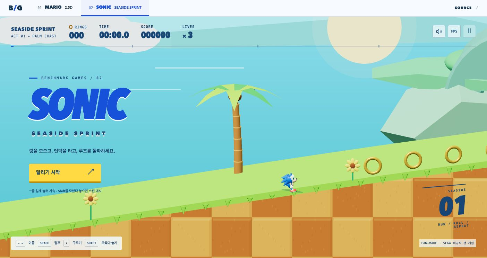
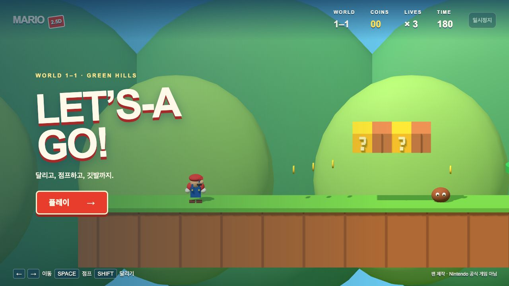
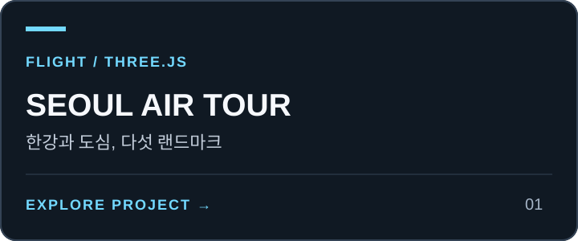
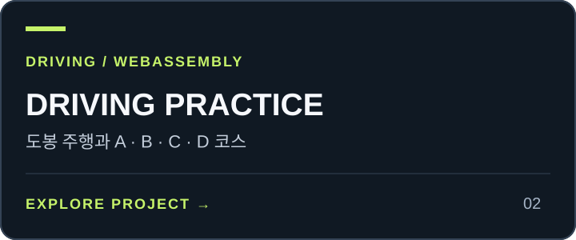

# Benchmark Games — Mario 2.5D, Sonic & More

[](https://minwoo19930301.github.io/benchmark-games/)
[](https://github.com/minwoo19930301/benchmark-games)
[](#run)

브라우저에서 플레이하는 Three.js 게임과 벤치마크 모음입니다. **Sonic — Seaside Sprint**가 기본으로 열리며, 상단 게임 선택기에서 **Mario 2.5D — Green Hills**로 전환할 수 있습니다. 선택한 게임만 불러옵니다.

- **Game 01 · Playable:** [Mario 2.5D — Green Hills](https://minwoo19930301.github.io/benchmark-games/#mario)
- **Game 02 · Playable:** [Sonic — Seaside Sprint](https://minwoo19930301.github.io/benchmark-games/#sonic)
- **Game 03 · Planned:** Additional retro/fan benchmarks

> [!NOTE]
> 비공식 팬/벤치마크 프로토타입입니다. Sonic 관련 캐릭터·상표는 SEGA, Mario 관련 캐릭터·상표는 Nintendo에 속합니다. 양사와 공식 제휴 관계가 없습니다. 이 프로젝트의 캐릭터 모델과 배경은 Three.js로 직접 구성했습니다.

[](https://minwoo19930301.github.io/benchmark-games/#sonic)

## Sonic — Seaside Sprint

푸른 해안을 달리며 링을 모으고 결승선까지 도달하는 2.5D 코스입니다. 120Hz 고정 물리로 가속·제동·경사면 관성을 계산합니다. 부스트로 속도를 얻으면 원형 트랙의 바닥, 양옆, 정상을 연속해서 지나 **360도 루프**를 완주합니다. 속도가 부족하면 아래쪽 지상 경로로 통과할 수 있습니다.

스프링, 부스트 패드, 적, 가시, 체크포인트가 배치되어 있습니다. 링이 있으면 피격 시 링을 잃고 잠시 보호받으며, 링 없이 맞으면 목숨을 잃습니다. 목숨은 3개이고, 남은 목숨이 있으면 마지막 체크포인트에서 이어갑니다. 소리는 사용자가 켰을 때만 재생되는 합성 효과음입니다. 직접 플레이한 최고 완주 시간은 해당 브라우저의 `localStorage`에 저장됩니다.

| 동작 | 키보드 |
| --- | --- |
| 이동 | ← / → 또는 A / D |
| 점프 | Space / W / ↑ |
| 구르기 | ↓ / S |
| 스핀 대시 | Shift를 눌러 충전한 뒤 떼기 |
| 일시 정지 | Esc |

화면의 터치 버튼으로도 이동·점프·구르기·스핀 대시를 조작할 수 있습니다. 창 포커스를 잃거나 탭을 숨기면 일시 정지하고 눌린 입력을 해제합니다.

FPS 패널의 **자동 벤치마크**는 같은 게임 시뮬레이션에 일반 이동·점프·충전 입력을 보내 코스를 진행합니다. 플레이어를 순간 이동시키거나 무적 상태로 만들지 않습니다. 자동 완주는 개인 최고 기록에 포함되지 않으며, FPS 수치는 현재 브라우저와 기기의 실행 결과입니다.

[소닉 검증 범위와 실행 근거](docs/sonic-verification.md)

## Mario 2.5D — Green Hills

[](https://minwoo19930301.github.io/benchmark-games/#mario)

Arrow keys / A,D move; Space / W / Up jump; hold Shift to run; Escape pauses. Touch controls support movement and jumping. Release jump for a short hop. Jump on enemies, collect coins and reach the flag; three lives and a 180-second timer. Blur or a hidden tab pauses and clears held controls.

## Run

Node 22.13+ and npm:

```sh
npm ci
npm run dev
```

The default local address is `http://127.0.0.1:4180/`. Open `#sonic` for Sonic or `#mario` for Mario; a URL without a game hash opens Sonic. `npm run build` writes a static `dist/` directory, and `npm run preview` serves it locally. Those local commands do not publish a deployment. A public GitHub Pages demo is linked above. Models, scenery, and font fallbacks work without external asset services.

## Verify

```sh
npm test
npm run typecheck
npm run lint
npm run build
npm audit
```

The suite contains **61 tests: 44 retained tests and 17 Sonic tests**. Sonic checks cover momentum, braking, jump edges, spin dash, ring collection, enemy collisions, damage grace, lives, checkpoints, pause input cancellation, restart, and bounded frame durations. Complete-course controllers use ordinary charge, jump, and movement inputs at 30, 60, and 120 Hz. They verify continuous loop entry, traversal of the top and both sides, exit momentum, and arrival at the finish without changing player position or health directly. This deterministic coverage is separate from browser rendering and physical touch-device verification; see the [Sonic verification record](docs/sonic-verification.md) for the checked scope.

### Historical Mario verification

The original 44-test suite covers Mario simulation, optional WebMCP contracts and the RAF clock. Complete-level controllers use normal movement/jump inputs at 30, 60 and 120 Hz, both with run held and with walking only, without teleporting or disabling enemies. The walk-only controller uses the movement/jump actions available on touch controls; it includes two natural deaths and finishes with one life, so this is not a no-death or real touch-event test. Other checks cover camera containment, pipe collision, variable jumps, lives, pause and restart. Contract tests use plain-object mocks, not a browser or WebGL context. The original Mario game UI and Button primitive are preserved.

CI performs clean installation, tests, type checking, lint and static build with read-only repository permission. It has no deployment job. Local source verification on 2026-09-07 passed all 44 tests, type checking, lint and build, with zero reported npm audit vulnerabilities. Actual desktop-browser checks verified the rendered scene, start/pause/resume controls and native WebMCP read/restart/pause calls. A frame-clock error found during this check was fixed and covered by six regression tests. Four repeated restart/resume cycles then produced no new browser warnings or errors. This is not full-level human-play or physical-device certification.

[마리오 검증 범위와 남은 한계](docs/verification.md)

## Architecture

- `index.html`, `src/main.tsx`, `vite.config.ts`: standalone Vite/React entry point and static build.
- `app/arcade.tsx`: hash-based game selection and lazy loading.
- `app/sonic.tsx`, `app/sonic.css`: Sonic HUD, controls, personal record, and benchmark panel.
- `lib/sonic/world.ts`: shared terrain, loop, ring, spring, boost, enemy, hazard, and checkpoint geometry.
- `lib/sonic/simulation.ts`: deterministic 120Hz movement, collisions, lives, and finish state.
- `lib/sonic/scene.ts`: procedural Three.js coast, character, scenery, and camera.
- `lib/sonic/renderer.ts`: input, animation loop, opt-in audio, benchmark controller, and resource lifecycle.
- `app/page.tsx`, `app/globals.css`: retained Mario HUD, keyboard/touch UI and layout; the `app` directory name does not imply a Next.js server.
- `lib/game/world.ts`, `lib/game/simulation.ts`, `lib/game/renderer.ts`: retained Mario geometry, simulation, and Three.js renderer.
- `lib/game/frame-clock.ts`: shared RAF timing with lifecycle reset and bounded frame durations.
- `lib/game/webmcp.ts`: optional Mario `document.modelContext` integration; read state, start/restart, and pause/resume tools. All accept an empty JSON object and unregister on lifecycle abort.

Mario's optional WebMCP integration remains inert when `document.modelContext` is unavailable. Native read/start/pause calls were verified in the historical desktop test browser; support in other browsers is not assumed. The public demo and source are unofficial fan work with no SEGA or Nintendo affiliation.

<!-- PROJECT-LINKS:START -->
## 3D Playground

게임·공간·아바타를 한곳에서. 카드를 누르면 저장소로, 아래 버튼을 누르면 공개 데모 또는 실행 안내로 이동합니다.

<table>
<tr>
<td width="50%" valign="top">
<a href="https://github.com/minwoo19930301/seoul-flight-game"></a><br>
<a href="https://minwoo19930301.github.io/seoul-flight-game/"></a>
<a href="https://github.com/minwoo19930301/seoul-flight-game/pulls"></a><br>
<sub>서울 25구 확장은 main에 병합 · 공개 데모 반영은 별도 확인 필요</sub><br>
<sub><a href="https://github.com/minwoo19930301/seoul-flight-game">저장소</a> · <a href="https://github.com/minwoo19930301/seoul-flight-game/pull/1">병합된 개선 PR #1</a></sub>
</td>
<td width="50%" valign="top">
<a href="https://github.com/minwoo19930301/parking-master-webasm"></a><br>
<a href="https://parking-master-webasm.vercel.app/"></a>
<a href="https://github.com/minwoo19930301/parking-master-webasm/pulls"></a><br>
<sub>공개 데모는 이전 버전 · 최신 소스는 저장소</sub><br>
<sub><a href="https://github.com/minwoo19930301/parking-master-webasm">저장소</a> · <a href="https://github.com/minwoo19930301/parking-master-webasm/pull/2">병합된 개선 PR #2</a></sub>
</td>
</tr>
<tr>
<td width="50%" valign="top">
<a href="https://github.com/minwoo19930301/interior3d"></a><br>
<a href="https://minwoo19930301.github.io/interior3d/"></a>
<a href="https://github.com/minwoo19930301/interior3d/pulls"></a><br>
<sub>공개 데모는 이전 버전 · 19종 모델은 최신 소스</sub><br>
<sub><a href="https://github.com/minwoo19930301/interior3d">저장소</a> · <a href="https://github.com/minwoo19930301/interior3d/pull/1">병합된 개선 PR #1</a></sub>
</td>
<td width="50%" valign="top">
<a href="https://github.com/minwoo19930301/animal-metaverse"></a><br>
<a href="https://minwoo19930301.github.io/animal-metaverse/"></a>
<a href="https://github.com/minwoo19930301/animal-metaverse/pulls"></a><br>
<sub>3D 3종 + 2D 3종 · 아래에서 바로 선택</sub><br>
<sub><a href="https://github.com/minwoo19930301/animal-metaverse">저장소</a> · <a href="https://github.com/minwoo19930301/animal-metaverse/pull/1">병합된 개선 PR #1</a></sub>
</td>
</tr>
<tr>
<td width="50%" valign="top">
<a href="https://github.com/minwoo19930301/flamingo-chess"></a><br>
<a href="https://minwoo19930301.github.io/flamingo-chess/"></a>
<a href="https://github.com/minwoo19930301/flamingo-chess/pulls"></a><br>
<sub>플라밍고 vs 흑조 · AI 대국</sub><br>
<sub><a href="https://github.com/minwoo19930301/flamingo-chess">저장소</a> · <a href="https://github.com/minwoo19930301/flamingo-chess/pull/1">병합된 개선 PR #1</a></sub>
</td>
<td width="50%" valign="top">
<a href="https://github.com/minwoo19930301/animal-hood-girl-vtuber"></a><br>
<a href="https://github.com/minwoo19930301/animal-hood-girl-vtuber#실행"></a>
<a href="https://github.com/minwoo19930301/animal-hood-girl-vtuber/pulls"></a><br>
<sub>macOS 로컬 앱 · 웹 플레이 링크 없음</sub><br>
<sub><a href="https://github.com/minwoo19930301/animal-hood-girl-vtuber">저장소</a> · <a href="https://github.com/minwoo19930301/animal-hood-girl-vtuber/pull/1">병합된 개선 PR #1</a></sub>
</td>
</tr>
<tr>
<td width="50%" valign="top">
<a href="https://github.com/minwoo19930301/flamingo-arcade-2"></a><br>
<a href="https://github.com/minwoo19930301/flamingo-arcade-2#로컬에서-실행"></a>
<a href="https://github.com/minwoo19930301/flamingo-arcade-2"></a><br>
<sub>2D 패러디 8종 + 로우폴리 3D 대전 · 코드만 공개, 미배포</sub>
</td>
<td width="50%" valign="top">
<h3>두 번째 플라밍고 게임 서랍</h3>
<p>라면 · 부적 · 전대 · 철거 · 가상 바탕화면 · 폐차 · 흑백 격투 · 로켓슛 · 장외 대전</p>
<a href="https://github.com/minwoo19930301/flamingo-arcade-2#카트리지-서랍"></a>
<a href="https://github.com/minwoo19930301/flamingo-arcade-2/blob/main/docs/visual-references.md"></a>
</td>
</tr>
</table>

### ANIMALVERSE · 여섯 세계 바로가기

<p>
<a href="https://minwoo19930301.github.io/animal-metaverse/versions/3d/"></a>
<a href="https://minwoo19930301.github.io/animal-metaverse/versions/3d-r3f/"></a>
<a href="https://minwoo19930301.github.io/animal-metaverse/versions/3d-babylon/"></a>
<a href="https://minwoo19930301.github.io/animal-metaverse/versions/2d-pixel/"></a>
<a href="https://minwoo19930301.github.io/animal-metaverse/versions/2d-pastel/"></a>
<a href="https://minwoo19930301.github.io/animal-metaverse/versions/2d-iso/"></a>
</p>

<sub>2026-09-07 확인: 공개 데모 5곳과 ANIMALVERSE 세부 경로 6곳은 HTTP 응답 확인. 화면·조작 검증을 뜻하지 않습니다. 위 개선 PR 6개는 병합됐습니다. Interior3D 공개 데모는 이전 배포이며, Driving Practice 공개 데모의 최신 확장 반영도 확인되지 않았습니다. “최신 PR”에는 병합 전 변경이 포함될 수 있습니다.</sub>

<!-- PROJECT-LINKS:END -->
