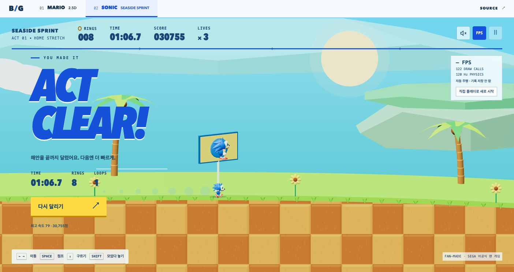

# Sonic — Seaside Sprint verification

2026-09-19. This is a playable fan-made benchmark with procedural models, scenery and synthesized sound. It does not load original game assets or external asset services.

## Gameplay and implementation

- One continuous coast course with hills, momentum, a full 360-degree loop, springs, boost pads, rings, enemies, spikes and three checkpoints.
- Arrow keys / A,D move; Space / W / Up jump; Down / S roll; hold then release Shift for a spin dash. Escape pauses. Touch buttons use pointer capture.
- Three lives, ring-loss protection, checkpoint respawns and a finish screen. Personal best times stay in local storage.
- The FPS panel can run an automatic benchmark using ordinary right/charge/jump inputs. It does not teleport, disable enemies, or save a personal best.
- Physics advances at fixed 120 Hz. The view shares level geometry with the simulation, instances repeated objects, caps device pixel ratio at 1.75, and reuses geometry/materials. Ready, paused, finished and hidden scenes do not run a continuous animation loop.
- Only the selected game is mounted. Switching Mario/Sonic disposes the renderer and unregisters its input listeners. Audio is optional and off initially.

Source is split into `lib/sonic/world.ts`, `simulation.ts`, `model.ts`, `scene.ts` and `renderer.ts`. React owns the HUD in `app/sonic.tsx`; `app/arcade.tsx` lazy-loads each game by hash route.

## Automated checks

All 61 tests, type checking, lint and the production build passed on 2026-09-19. The full suite contains 61 tests: 44 existing Mario/WebMCP/frame-clock checks and 17 new Sonic checks. Sonic coverage includes momentum, braking, jumping, spin dash, rolling combat, rings, damage grace, lives, checkpoints, loop entry/traversal/exit and jump detachment, restart, pause input clearing, invalid frame durations, and complete runs at 30/60/120 Hz. The complete-run controller uses the same ordinary inputs as the visible automatic benchmark button.

Run `npm test`, `npm run typecheck`, `npm run lint` and `npm run build` to reproduce the source checks. The Vite build reports its existing large-chunk advisory for the shared Three.js bundle; it is loaded separately from the initial UI. These checks do not certify a particular device's rendering performance.

## Actual browser observations

Chrome desktop, 1404 × 744, local Vite client:

- Automatic benchmark completed in 66.7 seconds with 3 lives, 8 rings, 30,755 points and one complete loop. The character was also visually observed at the top of the loop.
- Observed running snapshots showed 60 FPS. Draw calls varied with the visible course; this is a spot observation, not a cross-device or sustained performance guarantee.
- Start, Escape pause/resume, FPS controls, the finish screen, and the automatic-run label rendered. Automatic completion did not create a personal-best record.
- Mario still rendered and its Play/Pause controls worked after switching games. Returning to Sonic reset the stage. The DOM contained one canvas after each switch, with no horizontal overflow.
- No new browser warning/error logs were recorded during the final checks.

At a 390 × 844 browser viewport, the HUD and touch controls fitted the screen. Pointer interaction advanced the player, and automatic running kept the player visible after the portrait camera adjustment. This is viewport and pointer-event evidence, not a physical-phone test.

The earlier Mario checks remain in [verification.md](verification.md). Mario's optional WebMCP integration is unchanged; Sonic does not register WebMCP tools.
